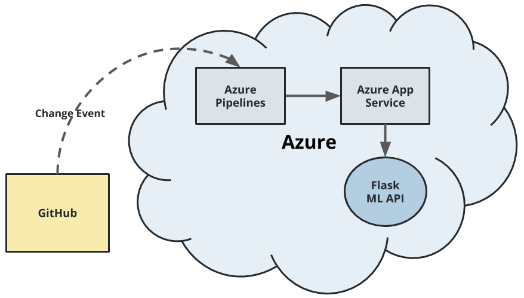

[](https://github.com/philbier/building-cicd-pipeline/actions/workflows/pythonapp.yml)

# Building a CI/CD Pipeline




# Overview
This is the final project for the course "Building a CI/CD pipeline" as part of of the Udacity Cloud DevOps Nanodegree. The goal is to build a complete continuous integration and continuous delivery pipeline using the following tools and concepts:
* **Github**: as a central code repository
* **Github Actions**: to trigger continous integration builds
* **Makefile**: that contains package dependencies, linting and testing steps
* **Azure Pipelines**: to continously deliver an Azure Web App if code is pushed to Github.

For this project a Pyhton-based machine learning application using the Flask web framework was provided. The model of that web app has been trained to predict housing prices in Boston accoriding to several feautres, such as average rooms in a home and data about highway access, etc.

## Project Plan
<TODO: Project Plan

* A link to a Trello board for the project
* A link to a spreadsheet that includes the original and final project plan>

## Instructions

<TODO:  
* Architectural Diagram (Shows how key parts of the system work)>

### Get the code
1. Make sure that your Azure Cloud Shell authenticates successfully agains Github with ssh-keys  
2. Clone this Github repo into your Azure Cloud Shell or local environment  
```bash  
git clone git@github.com:philbier/building-cicd-pipeline.git
``` 


### Locally test the CI process
Navigate into the cloned repo and locally test the code   
1. Run `make setup` to set up virtual environment      
2. Run `source ~/.building-cicd-pipeline/bin/activate` to source into the virtual environment    
3. Run `make all` to install requirements as well as run linting and testing    
You should see the following output for linting an testing  


### Configure continuous integration with Github Actions
The cloned repository already contains the workflow `pythonapp.yml`. You should find the workflow when clicking on the Actions tab within the main view of your GitHub repository. Test the workflow by making a small change (f.e. to the README file) and if the workflow runs. Your run should look like this.


### Create a Azure Web App Service
1. Create a resource group  
2. Create a Azure Web App within that resource group  
3. Check wether you web app is working via https://<your-appservice>.azurewebsites.net/  

### Configure continuous delivery pipeline on Azure DevOps**
(please be aware pop ups within your browser must be enabled, as you need to need to authenticate several times)

1. Go to your Azure DevOps Organization an create a project  
2. Within project settings go to **Service Connections** and create one with:  
    - **Scope level**: Subscription  
    - **Subscription**: <Your subscription>  
    - **Resource Group**: <Resource Group you created in a.>  
    - **Service connection name**: Flask ML App Service  
3. Go to **Pipelines** and create pipeline using the option **GitHub (YAML)**, select your repository and configure your Azure Web App with **Python to Linux Web App on Azure**
    g. Checkin your Azure Pipeline YAML file into Github
    h. Run your Azure pipeline workflow

A successful deployment should look like the following screenshot


### Verify your deployment
1. In order for create a prediction via the web app you need to change the following line within `make_predict_azure_app.sh`  
```
-X POST https://<yourappname>.azurewebsites.net:$PORT/predict
 ```
2. Commit and push the change to GitHub and check build & deployment.  
3. Run `./make_predict_azure_app.sh` in Azure Cloud Shell 

The output should look similar to this:  


When running, the Azure Web App produces streamed log files that should look like this:

```JSON
[{"machineName":"pl0sdlwk00000Z_default","lastUpdated":"2021-06-07T18:04:08.2996867Z","size":2948,"href":"https://flask-web-app.scm.azurewebsites.net/api/vfs/LogFiles/2021_06_07_pl0sdlwk00000Z_default_docker.log","path":"/home/LogFiles/2021_06_07_pl0sdlwk00000Z_default_docker.log"},{"machineName":"pl0sdlwk00000Z","lastUpdated":"2021-06-07T18:04:11.0911659Z","size":714,"href":"https://flask-web-app.scm.azurewebsites.net/api/vfs/LogFiles/2021_06_07_pl0sdlwk00000Z_docker.log","path":"/home/LogFiles/2021_06_07_pl0sdlwk00000Z_docker.log"}]
``` 

## Enhancements

<TODO: A short description of how to improve the project in the future>

## Demo 

<TODO: Add link Screencast on YouTube>


